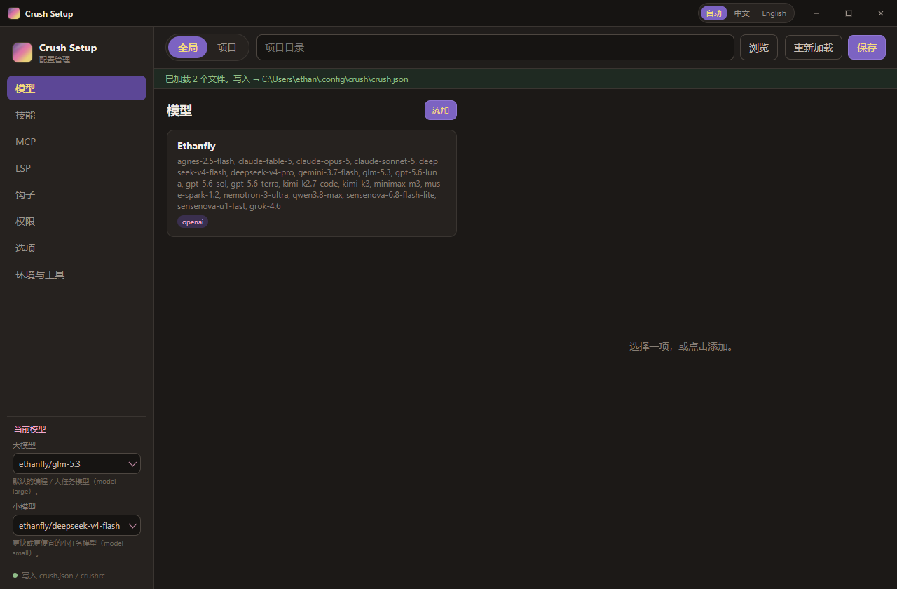
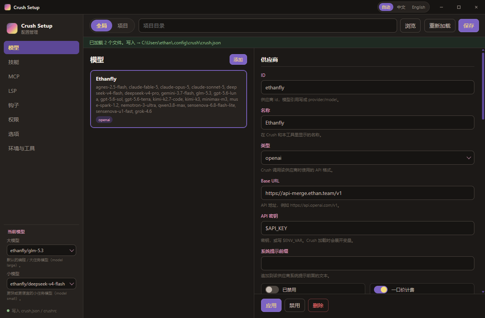
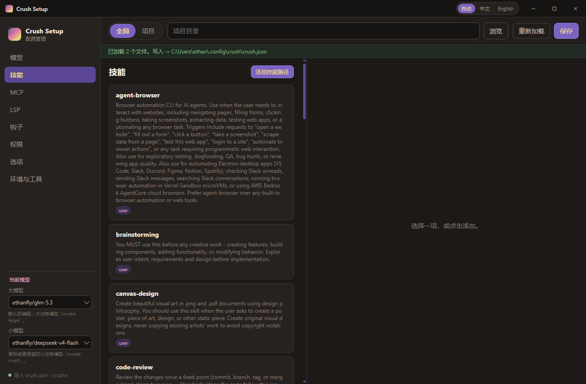
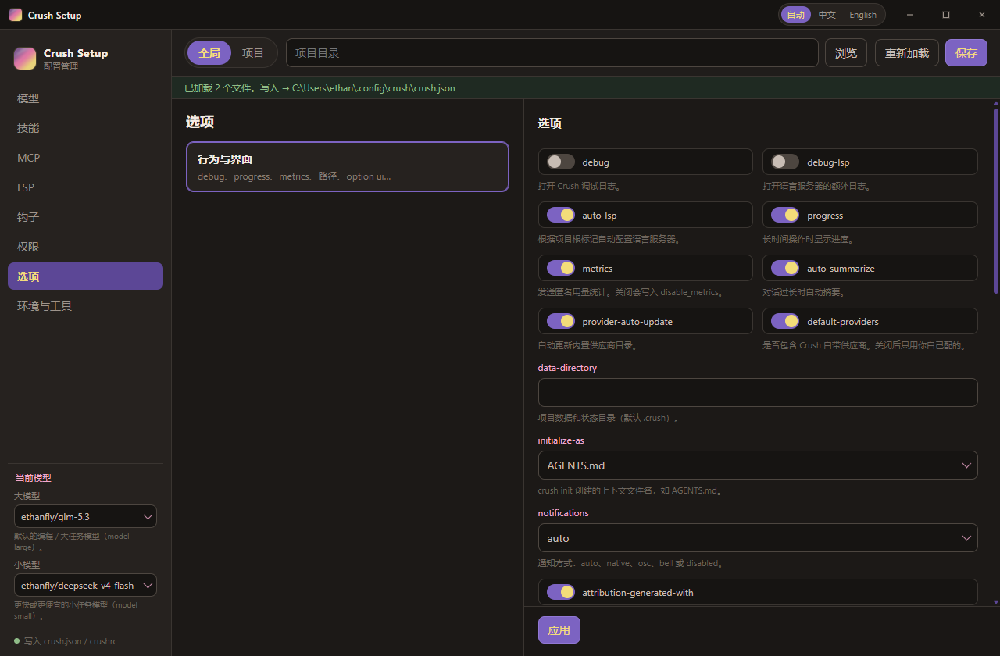

<p align="center">
  
</p>

<h1 align="center">Crush Setup</h1>

<p align="center">
  Crush 桌面配置管理器 · Desktop config manager for <a href="https://github.com/charmbracelet/crush">Crush</a>
</p>

<p align="center">
  <a href="https://github.com/ethanfly/crush-setup/releases"></a>
  <a href="https://github.com/ethanfly/crush-setup/actions/workflows/release.yml"></a>
</p>

管理 Crush 的 **模型 / 供应商、技能、MCP、LSP、钩子、权限、选项、环境变量和工具**，不用手改配置文件。界面是 Crush Charmtone 深色风格，交互参考 CC Switch：左侧分区 + 列表/表单。

Manages Crush **providers & models, skills, MCP, LSP, hooks, permissions, options, env, and tools** without hand-editing files.

## 界面 · Screenshots

### 模型 · Models

<p align="center">
  
</p>

<p align="center">
  
</p>

### 技能 · Skills

<p align="center">
  
</p>

### 选项 · Options

<p align="center">
  
</p>

## 功能 · Features

- 全局 / 项目两套作用域，读写 Crush 会加载的 `crush.json` / `crushrc`
- 供应商与模型：手动添加、拉取 `/models` 列表、编辑、删除
- 左侧固定大模型 / 小模型槽位（`model large` / `model small`）
- 技能发现与 `disable-skill`
- MCP（stdio / http / sse）、LSP、钩子、权限 allow/deny
- 选项与 option ui、`env`、`tools`
- 中英文自动适配，可手动切换
- 单实例窗口，自定义标题栏

## 安装 · Install

从 [Releases](https://github.com/ethanfly/crush-setup/releases) 下载最新构建：

- Windows：`Crush Setup-*-win-x64.exe`（安装包）或 portable `.exe`
- Linux：`.AppImage`
- macOS：`.dmg`

## 开发 · Development

```bash
npm install
npm start
```

```bash
npm test
npm run dist
```

推送到 `main`（代码有改动）会自动升版本、跑测试、打包 Windows / Linux / macOS，并发布 GitHub Release。

## 配置位置 · Config

- 全局：`%USERPROFILE%\.config\crush`（或 `$XDG_CONFIG_HOME/crush`）
- 项目：所选项目目录下的 `.crushrc` / `crushrc` / `.crush.json` / `crush.json`
- 机器状态 `%LOCALAPPDATA%\crush\crush.json` 只读，不会写回去
